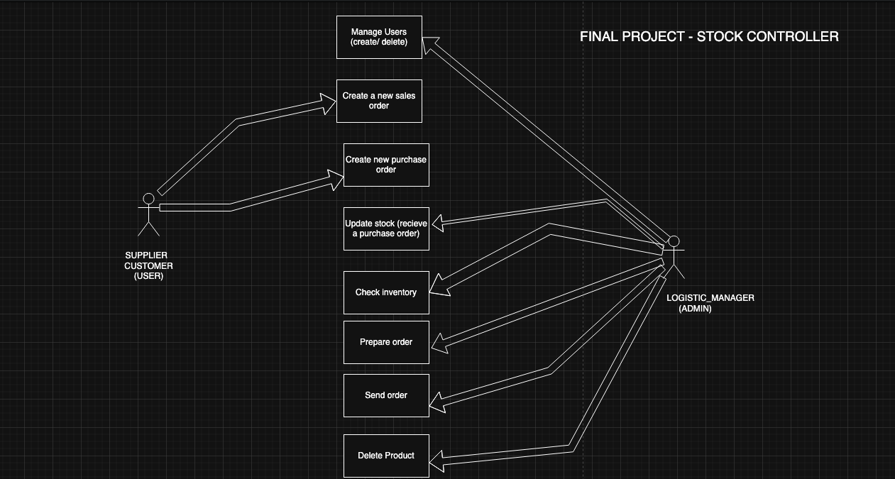

# 📝 Project Description

This Spring Boot API is designed for managing a product inventory system that supports users with different roles (Admins, Customers and Suppliers). It handles user creation and authentication, order management, supplier creation, and stock control. The system ensures security through role-based access and facilitates clean separation of logic using DTOs and service layers.

# 📊 Class Diagram

# ⚙️ Configuration
## 1.Clone the project
git clone https://github.com/Acidpresto/Products-Inventory.git
cd products-inventory

## 2.Database configuration
Update your application.properties or application.yml file:

spring.datasource.url=jdbc:mysql://localhost:3306/inventory_db

spring.datasource.username=root

spring.datasource.password=XXX

spring.jpa.hibernate.ddl-auto=update

## 3.Run the application
./mvnw spring-boot:run

## 4.Access the API

Using the browser executing:
http://localhost:8080

Postman: Use endpoint docs shared below:
src/main/resources/static

# 🛠 Technologies Used

- Java 17

- Spring Boot

- Spring Security

- Spring Data JPA

- Lombok

- MySQL

- Maven

- Postman (for API testing)

# 🧭 Controllers & Routes Structure

### Users Endpoints

| Method | Endpoint                     | Description                     | Access       |
|--------|------------------------------|---------------------------------|--------------|
| POST   | `/api/login`                 | Authenticate user and get token | Public       |
| GET    | `/api/users`                 | Get all users (DTO)             | Admin        |
| GET    | `/api/users/find?username=`  | Get user by username (DTO)      | Admin / User |
| POST   | `/supplier`                  | Create new supplier (DTO)       | Admin        |

### Orders Endpoints

| Method | Endpoint                          | Description                                                                                               | Access       |
|--------|-----------------------------------|-----------------------------------------------------------------------------------------------------------|--------------|
| GET    | `/orders/all/purchase`            | Get all purchase orders                                                                                   | Admin / User |
| GET    | `/orders/all/sales`               | Get all sales orders                                                                                      | Admin / User |
| POST   | `/orders/new/purchase`            | Create a new purchase order                                                                               | Admin        |
| POST   | `/orders/new/sales`               | Create a new sales order                                                                                  | Admin / User |
| PATCH  | `/orders/{id}/purchase/status`    | Update status of a purchase order and increase the stock number                                           | Admin        |
| PATCH  | `/orders/{id}/sales/status`       | Update status of a sales order and decrease stock number, move automatically to DELIVERED in certain time | Admin        |

### Product Inventory Endpoints

| Method | Endpoint                               | Description                              | Access       |
|--------|----------------------------------------|------------------------------------------|--------------|
| GET    | `/products/all`                        | Get all products                          | Public        |
| GET    | `/products/name-contains?productName=` | Search products by partial name match     | Public        |
| GET    | `/products/{id}`                       | Get product by ID                          | Public        |
| GET    | `/products/name?productName=`          | Get product by exact name                 | Public        |
| DELETE | `/products/delete/{id}`                | Delete product by ID                      | Admin         |
| PATCH  | `/products/{id}`                       | Update product by ID                      | Admin         |
| PUT    | `/products/new-product`                | Create a new product                      | Admin         |

# 🔗 Additional Links
- [Presentation Iron-hack](https://docs.google.com/presentation/d/1nHrAXNlDcw3AmtTqm9AGcS9IQPUxH_lMO6w856bhFTw/edit?usp=sharing)

# 🔮 Future Work

- Add stock recount, setting security stock and set a new order
- Include customer creation (POST)
- Reinforce the exceptions

# 📚 Resources

[Spring Boot Docs](https://chatgpt.com/c/684b2205-f5ac-8005-9077-0015a27b85c0)

# 👥 Team Members

    Marc Pedron Pladevall – Backend Developer

